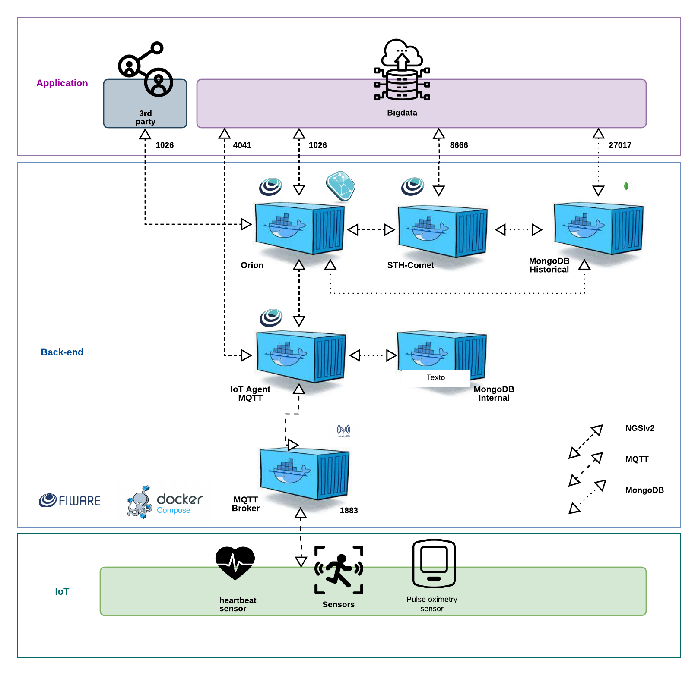

# Sprint-3-Edge

**🧑‍💻 Integrantes**
Alexandre Wesley – 561622

João Stellare – 565813

Kauê de Almeida Pena – 564211

Grupo: Data-Vine
Turma: 1ESPF
---
📌 **Descrição do Projeto**  
Este projeto simula um **sistema de monitoramento remoto** utilizando **ESP32**, integrando sensores DHT22 e MPU6050, com envio de dados via **MQTT**.  

O sistema captura:  
- **BPM (batimentos por minuto)** e **SpO₂ (oxigenação do sangue)** através de simulação pelo DHT22  
- **Aceleração** nos eixos X, Y, Z com o MPU6050  
- **Velocidade** estimada integrando a aceleração  
- Publicação de todos os dados em tópicos MQTT distintos para monitoramento em tempo real  

---

🏗 **Arquitetura Proposta**  
O ESP32 atua como dispositivo de borda (**Edge Device**), realizando a leitura dos sensores, processamento local e envio para o broker MQTT.  
Os dados podem ser consumidos em plataformas como **FIWARE Orion Context Broker**, **STH-Comet** ou visualizados via **Postman**.  

---

🛠 **Recursos Necessários**
- **ESP32** – microcontrolador principal  
- **DHT22** – sensor de temperatura e umidade (simula BPM e SpO₂)  
- **MPU6050** – sensor de aceleração e giroscópio  
- **WiFi** – conexão à rede local  
- **Broker MQTT** – para envio e monitoramento dos dados  
- **Bibliotecas Arduino**:  
  - Wire.h  
  - MPU6050.h  
  - WiFi.h  
  - PubSubClient.h  
  - DHT.h  

---

🔌 **Conexões**

**DHT22**
| Pino | Conexão |
|------|---------|
| VCC  | 3.3V    |
| GND  | GND     |
| DATA | GPIO 1  |

**MPU6050**
| Pino | Conexão |
|------|---------|
| VCC  | 3.3V    |
| GND  | GND     |
| SDA  | GPIO 5  |
| SCL  | GPIO 6  |
| INT  | GPIO 4  |

---

⚙️ **Configurações do Projeto**

**WiFi**
const char* default_SSID = "Wokwi-GUEST";
const char* default_PASSWORD = "";

---

**MQTT**
const char* default_BROKER_MQTT = "IP Máquina";
const int default_BROKER_PORT = 1883;

const char* TOPICO_SUBSCRIBE = "/TEF/des001/cmd";
const char* TOPICO_BPM = "/TEF/des001/attrs/bpm";
const char* TOPICO_SPO2 = "/TEF/des001/attrs/spo2";
const char* TOPICO_VELOCIDADEX = "/TEF/des001/attrs/velocidadeX";
const char* TOPICO_VELOCIDADEY = "/TEF/des001/attrs/velocidadeY";
const char* TOPICO_VELOCIDADEZ = "/TEF/des001/attrs/velocidadeZ";
const char* ID_MQTT = "des001";

---

**⚡ Funcionalidades**
Leitura de sensores DHT22 simulando BPM (60–100) e SpO₂ (90–100)

Leitura do MPU6050: aceleração nos eixos X, Y, Z

Cálculo de velocidade integrando aceleração

Publicação MQTT:

/TEF/des001/attrs/bpm → BPM

/TEF/des001/attrs/spo2 → SpO₂

/TEF/des001/attrs/velocidadeX/Y/Z → velocidade

Monitoramento em tempo real via Serial Monitor

---

**📡 Fluxo de Dados**

ESP32 lê sensores a cada 1 segundo

Calcula médias de BPM/SpO₂ (10 leituras)

Integra aceleração para cálculo de velocidades

Publica valores nos tópicos MQTT

Consumo via Postman, FIWARE Orion ou STH-Comet

---

**🚀 Como Testar**
Crie e configure uma máquina Virtual(Azure, AWS, etc)(Vídeo de Diogo Pelinson):
https://lnkd.in/p/gi_tbYD2

Baixe o Postman para fazer o frontend:
https://www.postman.com/downloads/

Baixe o fiware na máquina(git fiware do professor Cabrini):
https://github.com/fabiocabrini/fiware/tree/main

Abra o projeto no Wokwi:
https://wokwi.com/projects/442194358480221185

Modifique o ip do código do ESP e do Postman para a máquina com o fiware instalado.

Clique em Start Simulation

Abra o Serial Monitor para verificar leituras em tempo real

Verifique dados publicados no broker MQTT

Vídeo youtube do teste:

